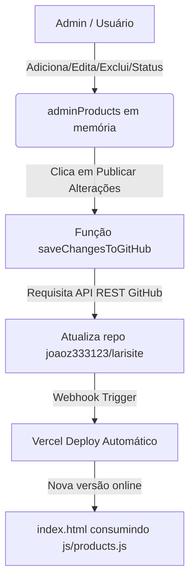

# Exato Enigma | Catálogo & Painel de Gerenciamento

Este repositório contém o código-fonte da aplicação web da **Exato Enigma**, loja de perfumaria importada, fragrâncias árabes e cuidados corporais baseada em Cianorte - PR.

O projeto foi construído utilizando uma arquitetura **JAMstack / Serverless**, combinando um frontend estático de alta performance com um painel administrativo que atualiza o repositório diretamente via API REST do GitHub.

---

## 🛠️ Tecnologias Utilizadas

- **HTML5 & CSS3**: Estrutura semântica e responsiva.
- **Tailwind CSS (CDN)**: Estilização moderna e utilitária.
- **FontAwesome 6**: Ícones vetoriais para interface.
- **JavaScript ES6 (Vanilla)**: Lógica do catálogo, gerenciamento do carrinho, manipuladores do DOM e consumo de APIs.
- **GitHub REST API**: Integração Serverless para persistência e atualização de dados a partir do browser.
- **Vercel**: Deploy automático via Webhooks vinculados aos commits do GitHub.

---

## 📁 Estrutura do Projeto

```
SiteLB/
├── index.html        # Página principal / Vitrine de produtos
├── admin.html        # Painel administrativo (CMS)
├── js/
│   └── products.js   # Banco de dados de produtos (Array JS)
└── README.md         # Documentação da aplicação
```

### Detalhamento dos Arquivos

1. **`index.html` (Vitrine Virtual)**:
   - **Exibição Dinâmica**: Renderiza os produtos a partir do arquivo `js/products.js`.
   - **Filtros e Busca**: Permite filtrar por categorias (*Perfumes*, *Body Sprays*, *Hidratantes*) e busca textual por nome/marca.
   - **Carrinho de Compras**: Drawer/modal lateral interativo que calcula subtotal e monta o pedido final.
   - **Checkout via WhatsApp**: Envia os itens do carrinho formatados diretamente para o WhatsApp do atendimento.

2. **`admin.html` (Painel Administrativo)**:
   - **Interface CMS**: Painel para gerenciamento do catálogo de produtos.
   - **Autenticação Segura no Cliente**: Armazena o *GitHub Personal Access Token* localmente no navegador (`localStorage`).
   - **Operações CRUD**: Permite criar, editar, excluir e visualizar fotos dos produtos.
   - **Publicação Direta**: Atualiza o arquivo `js/products.js` no repositório GitHub via API, disparando o deploy automático na Vercel.

3. **`js/products.js` (Banco de Dados em JS)**:
   - Arquivo responsável por armazenar a lista de produtos em formato de array de objetos JavaScript:
     ```javascript
     const products = [
       {
         "id": 1,
         "name": "Lattafa Yara Candy Eau de Parfum",
         "subtitle": "Miniatura 30ml",
         "category": "perfumes",
         "badge": "Árabe",
         "price": 79.9,
         "image": "https://...",
         "status": "available", // "available" | "out_of_stock" | "hidden"
         "description": "Uma fragrância fascinante com notas doces e frutadas, perfeita para momentos especiais." // Opcional (máx. 1000 caracteres)
       },
       ...
     ];
     ```

---

## 🔄 Fluxo de Funcionamento & Arquitetura



---

## ⚙️ Funcionalidades do Painel Admin (`admin.html`)

| Funcionalidade | Descrição |
| :--- | :--- |
| **Listagem & Contador** | Exibe todos os produtos cadastrados com foto, nome, categoria, selo, status e preço. |
| **Controle de Status** | Permite definir cada produto como **🟢 Disponível**, **🟡 Sem Estoque** ou **🔴 Oculto**. |
| **Gestão de Promoções** | Permite ativar produtos em promoção, definir preço original (de) x promocional (por) com botão de atalho `🏷️` rápido. |
| **Alternância de Status em 1 Clique** | Botão de rotação rápida na tabela para alternar o status instantaneamente. |
| **Busca Interna** | Filtra os produtos da tabela por nome, subtítulo, selo, status ou termo "promoção". |
| **Formulário Modal (Criar/Editar)** | Interface modal para inserir ou alterar todos os atributos do produto, incluindo preço promocional, status e foto. |
| **Exclusão com Confirmação** | Remove itens do catálogo com alerta de confirmação. |
| **Configuração de Token GitHub** | Permite inserir e atualizar o Token de Acesso Pessoal (PAT) do GitHub de forma segura. |
| **Publicação Serverless** | Converte a lista atualizada em string JS, obtém o `sha` atual via API do GitHub e envia uma requisição `PUT` para sobrescrever o arquivo no repositório. |

---

## 🔑 Configuração do Token do GitHub para o Admin

Para salvar alterações no site utilizando o `admin.html`:

1. Acesse **GitHub -> Settings -> Developer Settings -> Personal Access Tokens (Tokens classic)**.
2. Gere um novo token com permissão de escopo **`repo`** (leitura e escrita nos repositórios).
3. Abra a página `admin.html`.
4. Clique em **"Configurar Chave GitHub"** no topo da tela.
5. Cole a sua chave (`ghp_...` ou `github_pat_...`) e clique em **Salvar Chave**.

> 🔒 **Segurança:** O token é armazenado **exclusivamente no seu navegador** (`localStorage`) e nunca é enviado para nenhum servidor terceirizado.

---

## 🚀 Como Executar Localmente

1. Clone este repositório:
   ```bash
   git clone https://github.com/joaoz333123/larisite.git
   ```
2. Abra a pasta do projeto e inicie um servidor HTTP local (como a extensão **Live Server** do VS Code ou executando `npx serve` no terminal).
3. Acesse `http://localhost:3000` (ou a porta atribuída) para o site principal e `http://localhost:3000/admin.html` para o painel de administração.
